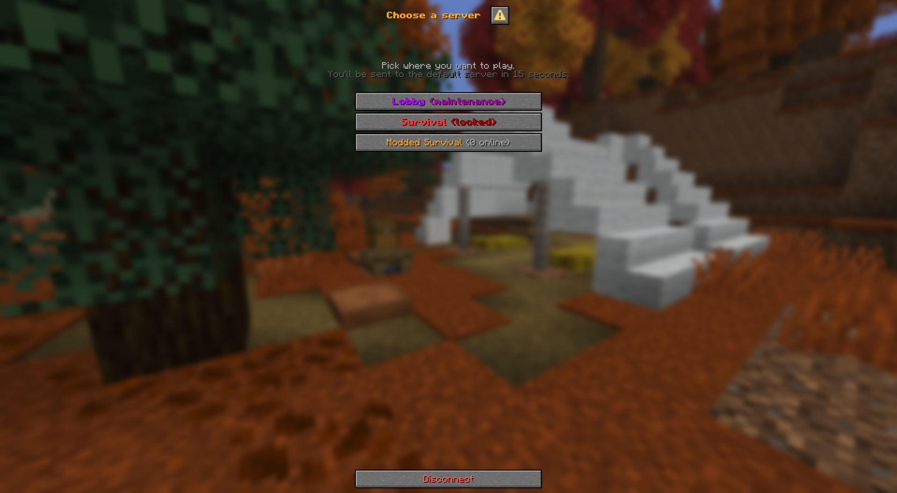
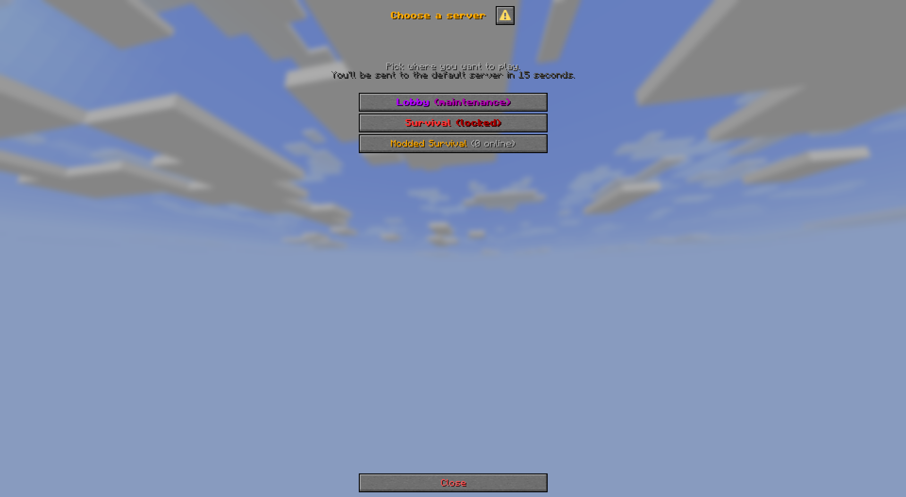
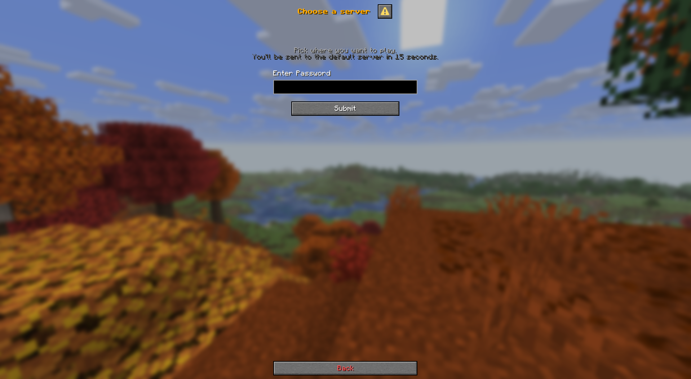
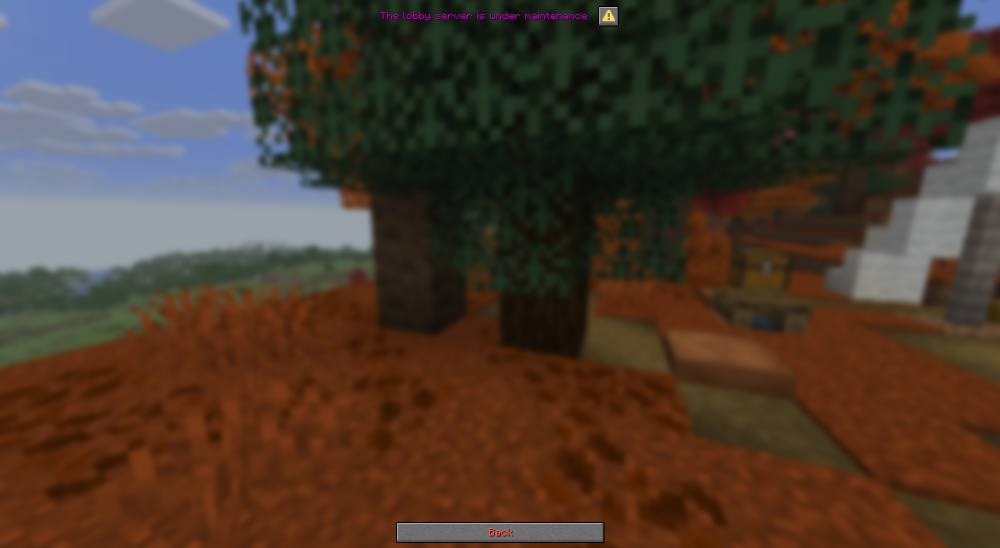
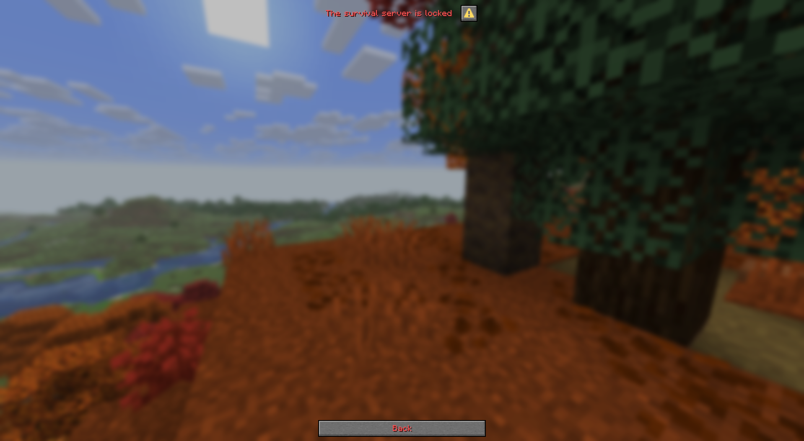

# VelocityServerDialog



---

This is a velocity plugin to allow players to pick which server they want to join, before being thrown into a default.

### Features:
- Slick-looking dialog menu
- Configurable maintenance mode, and maintenance bypass permission
- Ingame commands to open menu and manage maintenance mode
- Per-server permissions
- Per-server passwords
- Modded client detection - prevent vanilla clients from attempting to join modded servers
- Timeout - move player to a default server if they don't select one

### Commands:
- `/serversdialog` - Open server picker dialog - permission: `velocityserverdialog.serversdialog`
- `/serversdialog <server> <maintenance: true|false>` - permission: `velocityserverdialog.serversdialog`
  - `<server>` - specify which server to change maintenance status 
  - `<maintenance: true|false>` - specify enable/disable maintenance


## Setup
1. Place jarfile in a velocity proxy server (`plugins` directory)
2. Start/restart velocity proxy
3. Update config with backend server info
4. Restart velocity proxy


## Config
<details>

<summary> Default Config </summary>

```toml
# Seconds before an undecided player is sent to the default server from velocity.toml's "try" list
# (clamped 5..25; client times out ~30s)
timeout-seconds = 15
# What to do with clients older than 1.21.6 (no dialog support): "default" | "kick"
legacy-clients = "default"
# Number of columns in the dialog GUI
columns = 1

default-server = "lobby" # server in velocity.toml that the player will be sent to on timeout or without dialog support
maintenance-perm = "mantinence.access" # Permission to access server that are under mantinence

title = "<gold><bold>Choose a server"
body  = "<gray>Pick where you want to play.\n<dark_gray>You'll be sent to the default server in 15 seconds."
kick-quit-message = "<gray>Goodbye!"

# Leave empty to list every server registered in velocity.toml
[[server]]
velocity = "lobby"           # name in velocity.toml
display = "<green>Lobby"
description = "<gray>Hub & minigames"
type = "vanilla" # server type - used to check client/server version for modded
maintenance = false

[[server]]
velocity = "survival"
display = "<aqua>Survival"
description = "<gray>Vanilla survival"
type = "vanilla"
permission = "server.survival"

[[server]]
velocity = "modded"
display = "<gold>Modded Survival"
description = "<gray>Modded survival"
type = "fabric"
password = "moddedpw"
```

</details>

### Breakdown
- `timeout-seconds` - The amount of time a player has before being sent to the default server. Default: 15
- `legacy-clients` - What to do with a client that is pre-1.21.6 (no dialog support). Options: "default", "kick". Default: "default"
- `columns` - Number of columns to fit server buttons into. Default: 1
- `default-server` - What velocity server to send legacy or timed-out clients to.
- `maintenance-perm` - What permission to allow players to join servers under maintenance. Default: "maintenance.access"
- `title` - The title of the server picker dialog
- `body` - The subheading of the server picker dialog
- `kick-quit-message` - The message to send players when using the 'disconnect' button at the bottom of the dialog
- Servers
  - `velocity` - Name of the server in `velocity.toml`
  - `display` - The display name for the dialog menu
  - `description` - The hover text for the dialog menu
  - `type` - The type of server. "vanilla" for vanilla servers, anything else will require a non-vanilla client to join.
  - `permission` - The permission that the player must have to access this server via server picker dialog
  - `password` - The custom password that the player must enter to access this server via server picker dialog
  - `maintenance` - The enabled/disabled state of maintenance mode for this server. `true` is maintenance enabled, `false` is maintenance disabled

### Adding a server
To add another server to the dialog menu, open the configuration file and add another `[[server]]` heading.
Then add the appropriate information fields for the server (`velocity`,`display`,`description`, etc.)
All config file changes will be loaded automatically without a server restart.


## Notes
- The `default-server` setting takes priority over maintenance mode, passwords, and permission restrictions provided by this plugin. (If a server is both set as `maintenance = true` and `default-server`, the player will still be sent to that server after the timeout period)


## Images

<details>
<summary>Dialog Menus</summary>







</details>
